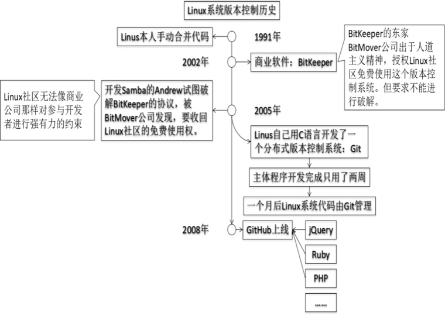
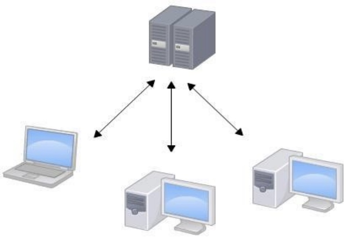
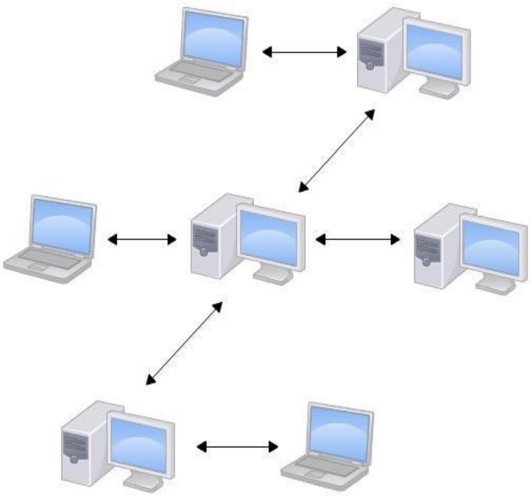
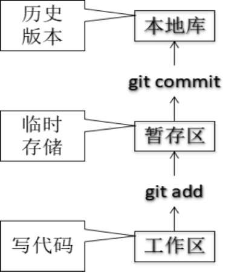
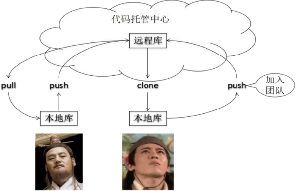
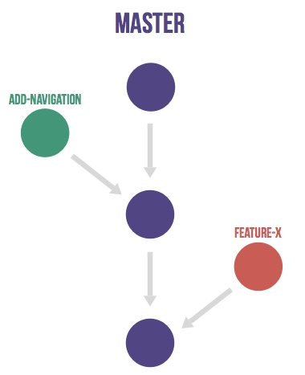
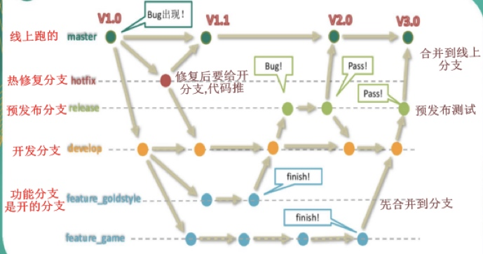

# Gitlab 使用分享

## 一、Git历史及优势

在git之前还有 CVS、SVN 等版本控制工具。git算是版本控制的集大成者
下面将SVN和git做个简单的比较：
SVN 集中式的版本控制工具

1.所有文件全部集中在一台服务器上，当服务器宕机，所有人都将无法正常工作。
2.当连接服务器的人数过多时，SVN服务容易卡死

git 分布式版本控制工具
1.分布式使得每个用户都有完整的库，以及历史版本。

## 二、git结构与工作流
### 1.git结构

图中为一个库中的git结构，分为工作区、暂存区、本地库
工作区修改代码 add添加改动到暂存区，当需要回退时使用`git rm  ——cached filename`即可撤回add所添加的改动，添加完之后使用`git commit filename`提交代码，提交的同时会记录指针HEAD，其内容为一个通过哈希加密算法算出来的密文
注：哈希算法不可逆，文件略改动一点，密文完全变化。

### 2.git协作流程

岳不群创建本地库，并把本地库推送(push)到远程库。令狐冲clone远程库到本地库，进行开发修改，当修改完成后(push)到远程库，岳不群操作远程库，将令狐冲加入团队。让其可修改远程库代码，修改完成后。岳不群把远程库中的代码重新使用拉(pull)下来。

### 3.git工作流
集中式工作流

基本跟SVN的工作方式差不多，只有一条master分支，其他开发人员拉去代码，修改后提交，直接合并到master分支上，并不适用与实际生产。

GitFlow

完整的分支工作流，在实际应用中并不一定需要如此复杂。很多实用预发布分支和开发分支是放到一起的。

## 三、实用演示
无仓库流程
1.初始化本地库
`git init`
2.创建签名. 签名分系统级(system)、全局(global)、仓库级(local)
`git config --global user.name "developer"`
`git config --global user.name "12345abc@163.com"`
3.新建项目文件，并提交一次（目的是为了生产master分支)
`git add filename`
`git commit -m "first commit"`
4.新建分支,在分支上工作
`git branch branchname` #创建分支
`git checkout branchname`  #切换分支
或者用 `git checkout -b branchname` 创建分支的同时切换分支
5.创建并关联远程仓库
`git remote add origin http://192.168.0.100:10000/Chengjk/gittest.git`
6.将修改的代码推送给远程仓库
`git push origin branchname`
7.在远程仓库上合并分支
页面操作就不提了。